Environnement python
====================

Introduction
------------

Le ``Python`` est un langage **interprété**, c’est à dire que les
instructions écrites dans un simple fichier texte par l’utilisateur sont
ensuite “traduites” par le programme ``Python`` en instructions
exécutables par l’ordinateur.

Il est donc nécessaire de disposer de cet interpréteur pour pouvoir
exécuter un programme écrit en python.

Si votre établissement dispose de l’ENT Pentila Nero (celui auquel on
accède via
`www.l-educdenormandie.fr <https://www.l-educdenormandie.fr>`__), vous
avez déjà un environnement python prêt à être utilisé.

Si ce n’est pas le cas, alors vous allez devoir passer par l’étape
“installation de python”, un peu plus loin dans ce document.

Python via l’ENT
----------------

Pour utiliser les fonctionnalités python via votre ENT, connectez vous
sur votre ENT “comme d’habitude”.

.. figure:: ./images/nero-login.PNG
   :alt: Connexion Nero

   Connexion Nero

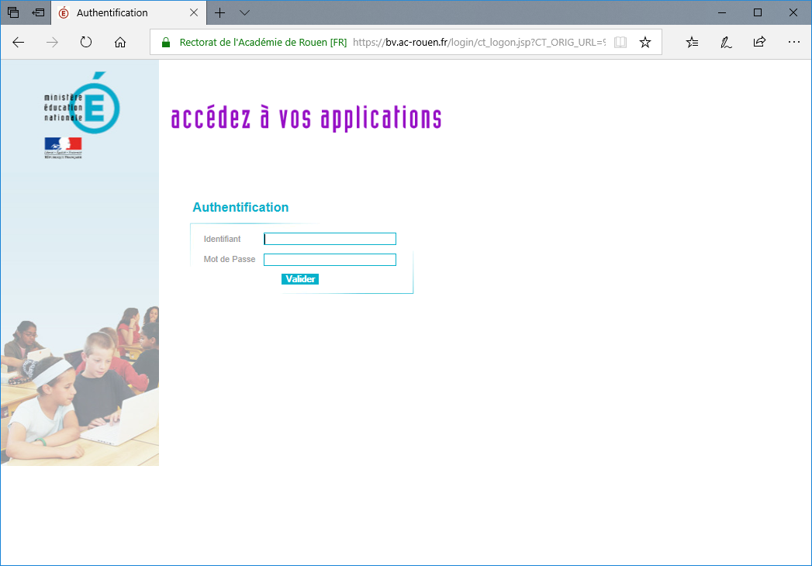

   Connexion académique

Naviguez ensuite vers votre espace “Mes documents”

.. figure:: ./images/nero-home.PNG
   :alt: Mes documents

   Mes documents

Cliquez ensuite sur le bouton “Créer” (ou bien via un clic droit de la
souris) : dans la liste des formats de fichier disponible, vous devriez
voir apparaître “Jupyter Notebook”.

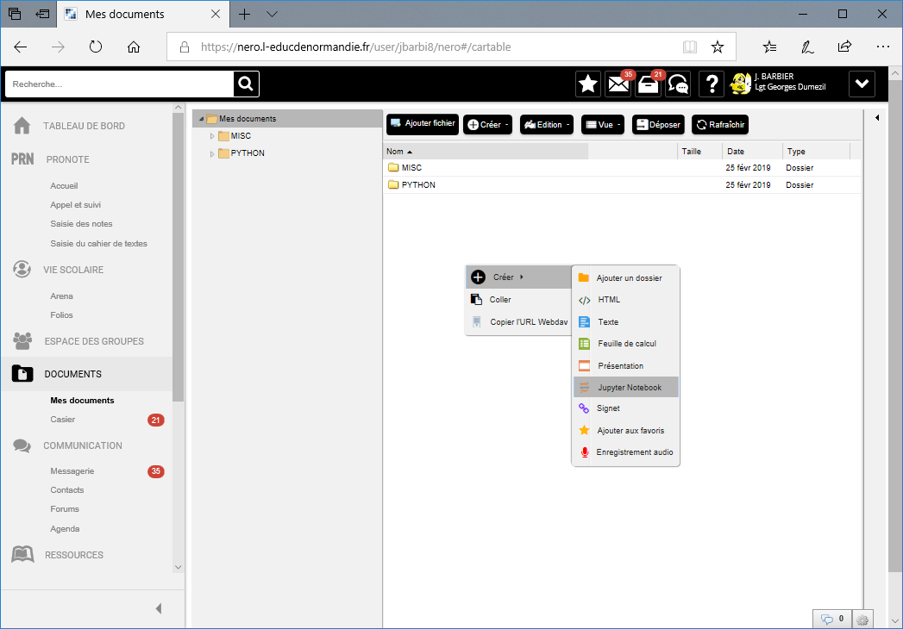

   Créer un notebook 1

Si “Jupyter Notebook” n’apparaît pas, il faut demander à
l’administrateur ENT de votre établissement de l’activer. La procédure
prend moins d’une minute, les détails sont à la fin de ce document).

Si il apparaît, cliquez dessus, et nommez votre fichier. Une fenêtre
apparaît alors, c’est votre nouveau notebook.

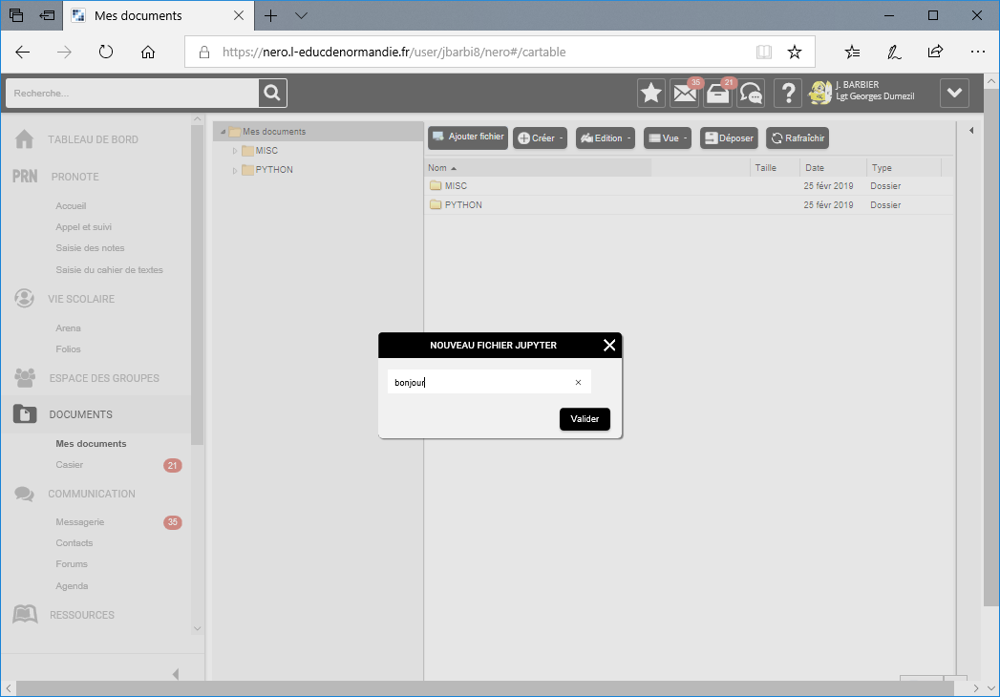

   Créer un notebook 2

Vous alors pouvez taper

.. code:: python

   print("Bonjour le monde")

dans la cellule “In”.

.. figure:: ./images/nero-jupyter-3.PNG
   :alt: Créer un notebook 3

   Créer un notebook 3

Exécutez ensuite ce premier programme en cliquant sur le bouton “Run”.
Vous devriez voir apparaître la phrase “Bonjour le monde” juste en
dessous.

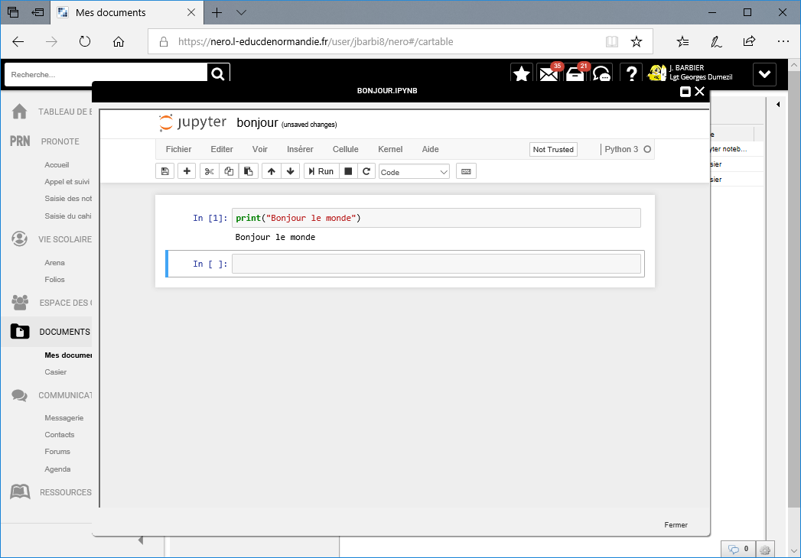

   Créer un notebook 4

Vous avez exécuté votre premier programme python. Vous pouvez maintenant
passer à la suite de ce document, en sautant éventuellement les deux
chapitres suivant.

Installation de python sous Windows
-----------------------------------

Le programme ``Python`` seul, que l’on trouve sur le site
`python.org <https://python.org>`__ n’est donc pas très gros, quelques
méga-octets au plus. Il en existe plusieurs générations, que l’on repère
à leur numéro de version : ``2.x`` ou ``3.x``. Il est fortement
recommandé d’utiliser la génération ``3.x`` (3.7 aujourd’hui), même si
beaucoup d’exemples que l’on peut trouver sur internet sont de la
génération ``2.x``.

``Python`` seul a déjà beaucoup de fonctionnalités à la base. Mais ce
qui fait sa richesse, c’est le nombre énorme de “paquets” qu’on peut lui
ajouter (des fonctionnalités créées par d’autres personnes et qu’on peut
directement réutiliser).

Il n’est pas évident de rajouter à la main un paquet sous windows, c’est
pour cela que plusieurs *distributions* de python (le programme python +
un choix de paquets) sont disponibles. Chaque distribution a ses
avantages et ses inconvénients. Nous avons fait le choix d’utiliser une
des plus complètes, `anaconda <https://anaconda.com>`__.

Installation
~~~~~~~~~~~~

Les instructions suivantes sont pour une installation sous Windows 10,
64 bits, sur un système avec au moins 3 Go de disque disponible.

Si une autre version de python est déjà présente sur le système, il vaut
mieux la désinstaller au préalable. Anaconda n’est pas intrusif, mais
d’autres distributions le sont plus et peuvent poser un problème de
cohabitation.

**Etape 1** Télécharger anaconda

Sur le site `anaconda.com <https://anaconda.com>`__, bouton **Download**
en haut à gauche. Choisir la version correspondant à votre système
(32/64 bits).

Le téléchargement prend un certain temps (+ de 600 Mo).

   Installer anaconda 01

.. figure:: ./images/anaconda-install-02.PNG
   :alt: Installer anaconda 02

   Installer anaconda 02

**Etape 2** Installer anaconda

Lancer le programme d’installation; les valeurs par défaut des
différentes étapes sont suffisantes, en gros :

-  accepter la licence
-  choisir une installation “mono-utilisateur” (juste pour vous)
-  choisir le dossier d’installation (si possible, un chemin sans
   espaces est préférable)
-  définir anaconda comme interpréteur python par défaut

|Installer anaconda| |Installer anaconda| |Installer anaconda|
|Installer anaconda|

Puis attendre la fin de la copie des fichiers (qui prend aussi un
certain temps)

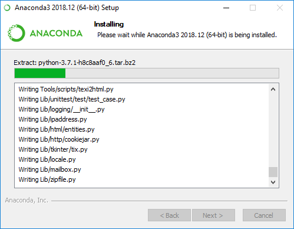

   Installer anaconda

Une fois la copie des fichiers terminées et l’apparition de quelques
fenêtres noires (qu’il ne faut pas fermer, elles se ferment toute seules
quand elles ont terminé leur travail), l’installateur propose
l’installation de Visual Studio Code (un éditeur de code d’assez bonne
qualité). Vous pouvez l’installer ou non, au choix, nous utiliserons un
autre éditeur pour l’instant.

Puis il propose deux autres cases à cocher pour en apprendre plus, vous
pouvez les décocher ou jeter un coup d’oeil aux ressources proposées.

Anaconda est alors installé.

Exécution : Anaconda Navigator
~~~~~~~~~~~~~~~~~~~~~~~~~~~~~~

Les différentes fonctionnalités d’anaconda sont regroupées dans une
interface appelée *Anaconda Navigator*. Vous pouvez y accéder par le
menu Démarrer, dans la rubrique *Anaconda*.

.. figure:: ./images/annav-01.png
   :alt: Exécuter anaconda

   Exécuter anaconda

La page d’accueil d’Anaconda Navigator présente les différentes
applications installées (Launch) ou installables (Install).

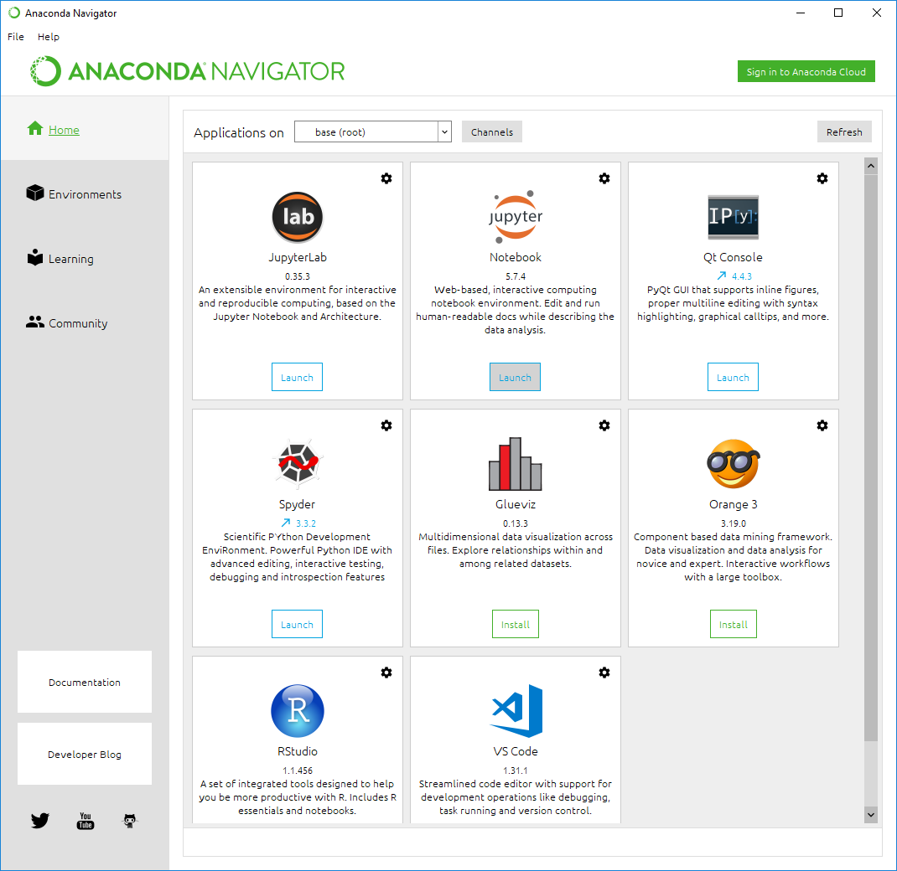

   Exécuter anaconda

La plupart des exemples de ce guide sont des **Notebooks Jupyter**.
Démarrer Jupyter en cliquant sur “Launch”; au premier lancement, vous
aurez éventuellement à choisir le navigateur de votre choix pour
utiliser les notebooks. Choisissez ce que vous voulez sauf Internet
Explorer.

Dans la fenêtre de navigateur qui s’ouvre, vous trouverez la liste de
vos dossiers. Vous pouvez naviguer dans l’arborescence de vos documents;
choisissez le répertoire de votre choix, et une fois que vous êtes
dedans, vous pouvez créer votre premier notebook : bouton “New” en haut
à droite, choisir “Python 3”.

.. figure:: ./images/annav-jupyter-1.PNG
   :alt: Exécuter anaconda

   Exécuter anaconda

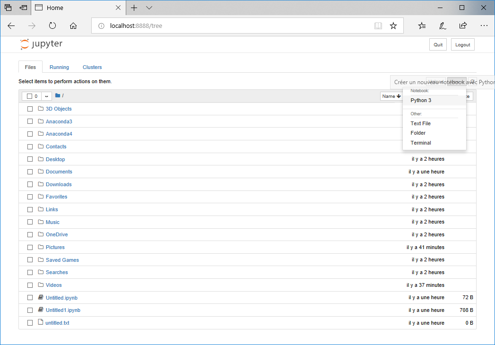

   Exécuter anaconda

Un nouvel onglet s’ouvre alors, avec votre notebook.

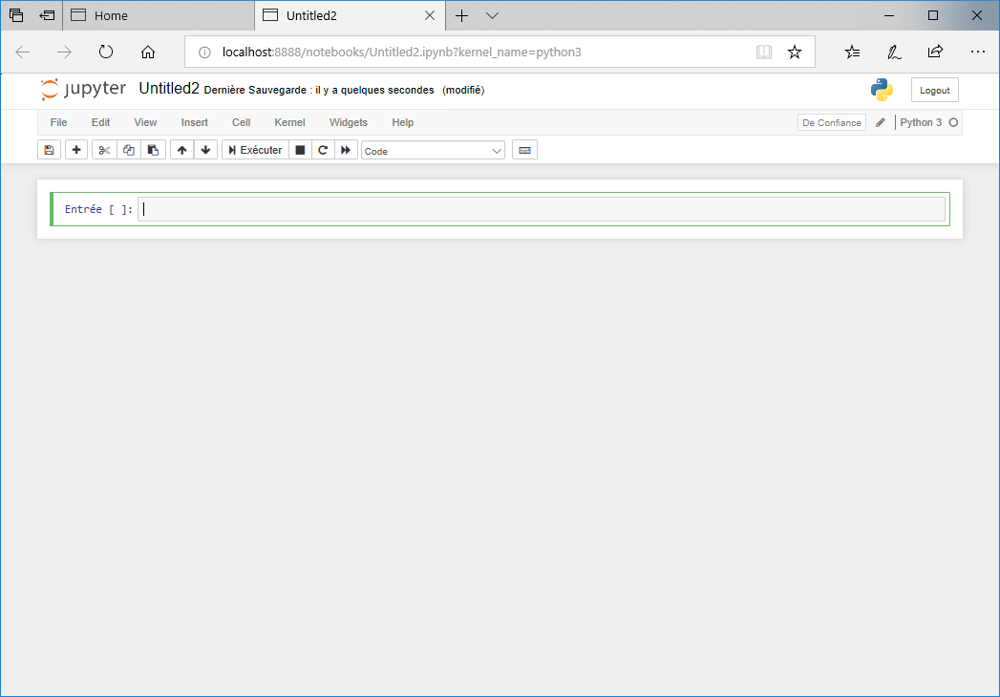

   Exécuter anaconda

Pour modifier le titre du notebook, cliquez dessus une fois qu’il est
ouvert. Dans la cellule “Entrée”, vous pouvez écrire

.. code:: python

   print("Bonjour le monde")

et cliquer sur le bouton “Exécuter”. Vous devriez voir apparaître la
phrase “Bonjour le monde” juste en dessous.

Vous avez fait votre premier programme en python. Vous pouvez maintenant
continuer à explorer les ressources de ce guide.

Activation des notebooks sur Nero
---------------------------------

TODO

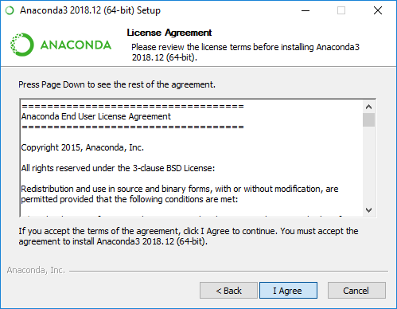
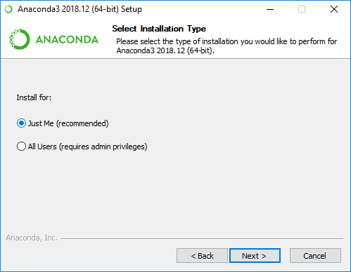
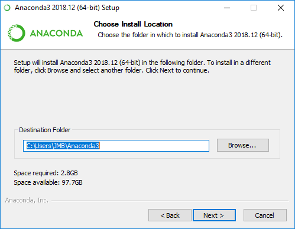
.. |Installer anaconda| image:: ./images/anaconda-install-06.PNG

