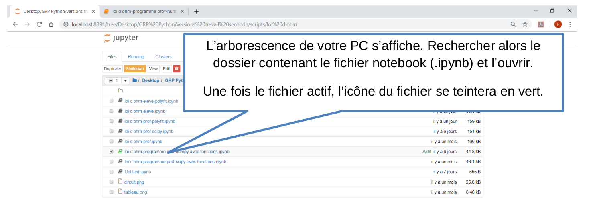
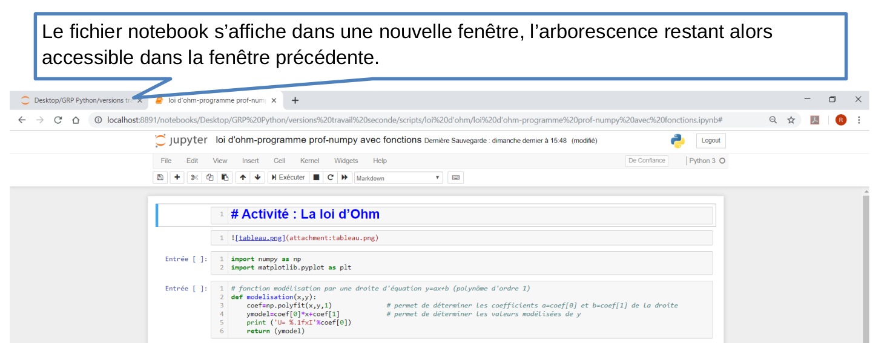
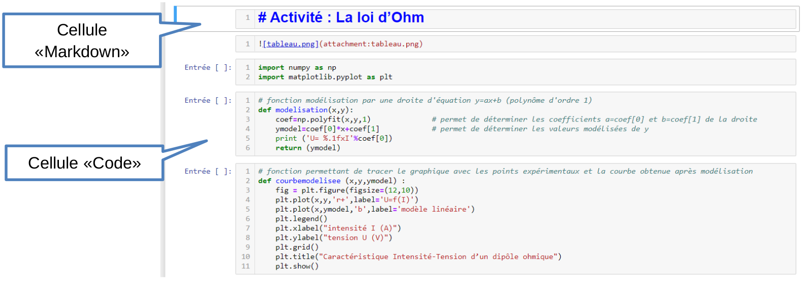
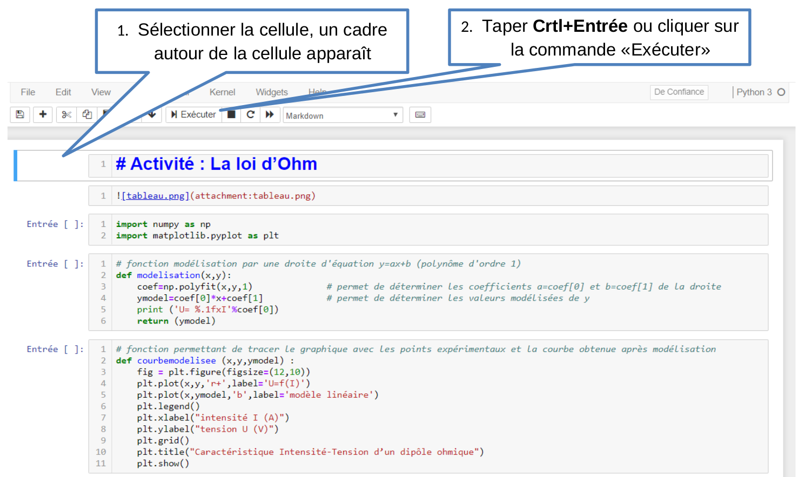
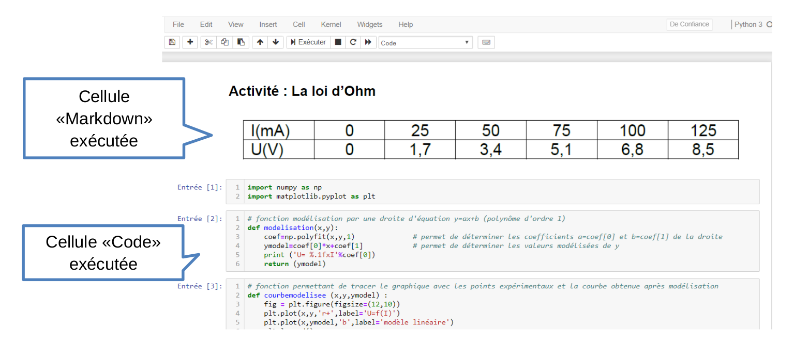
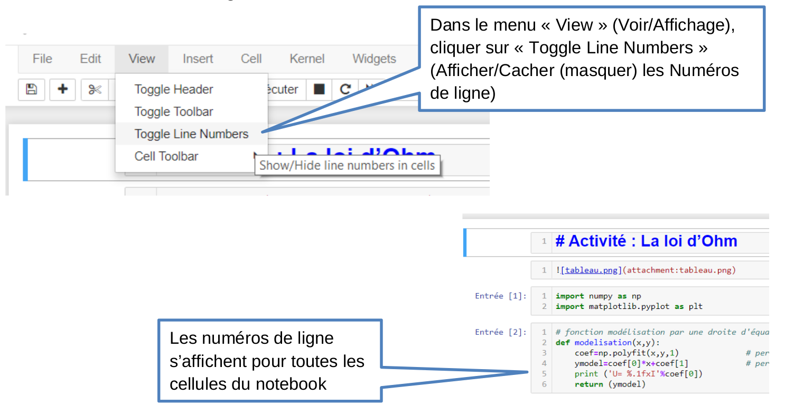
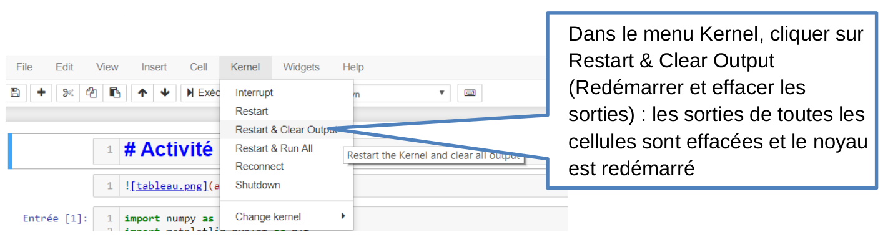

# Guide d’utilisation rapide du Notebook Jupyter

Après avoir téléchargé & installé Anaconda sur votre ordinateur : 

Remarque : Dans le cas où votre fichier Notebook se situe dans le
dossier Mes documents de votre ENT, ouvrez directement le fichier en
cliquant sur son nom.

Un fichier notebook se présente comme une succession de cellules qui
sont de deux types :

- des cellules « Markdown » permettant d’écrire du texte (titre,
  contexte de l’activité, consignes élèves...), d’insérer des fichiers
  image... 
- des cellules « Code » permettant d’écrire des lignes de code en
  langage Python puis de les exécuter. Le mot « Entrée [ ] » (ou « In [
  ] ») est écrit dans la marge à gauche dans ce type de cellule.

Copie d’écran avec des cellules « Markdown » et une cellule « Code ».

## Comment utiliser un fichier Notebook

Pour utiliser votre fichier Notebook, il faut exécuter les cellules du
Notebook dans l’ordre, les unes après les autres.

Pour cela :

Copie d’écran avec les cellules « Markdown » et « Code » précédentes
exécutées.

- Si la cellule est de type « Markdown » : les textes, les images
  jointes... entrés dans la cellule apparaissent dans leur forme lisible
  par l’utilisateur du fichier Notebook. Lors de l’ouverture du fichier,
  ces cellules ont souvent déjà été exécutées par le créateur du
  fichier, ce qui permet de faire de belles présentations notamment à
  destination des élèves. 

- Si la cellule est de type « Code » : Lors de l’exécution, une
  étoile * apparaît entre les crochets puis une fois la cellule
  exécutée, le « numéro d’ordre d’exécution » s’affiche. 

Il est très important d’exécuter les cellules de code dans l’ordre du
programme. Les nombres entre crochets peuvent ne pas se suivre un
par un notamment si vous exécutez une même cellule plusieurs fois
de suite mais l’ordre de ces nombres doit être croissant au fur et à
mesure que l’on avance dans le fichier Notebook.

Une fois exécutée, le résultat de l’exécution (sortie/output)
s’affiche dans la cellule sous le code (cela peut être un
message d’erreur si votre code est erroné). Il peut ne rien
s’afficher si le code ne le demande pas.

Il est possible d’exécuter une même cellule plusieurs fois de
suite lorsque vous voulez modifier et tester le code qu’elle
contient. Dans ce cas, il n’est pas nécessaire de réexécuter
les cellules précédentes, ni de supprimer la sortie précédente
de la cellule concernée car elle sera remplacée
automatiquement lors de la nouvelle exécution de la cellule.

Enfin, il est possible de réexécuter le fichier Notebook depuis la
première cellule après une ou plusieurs exécutions.

Cliquer alors sur les commandes « interrompre le noyau » puis «
redémarrer le noyau (avec confirmation) » ou « redémarrer le noyau et
ré-exécuter tout le notebook (sans confirmation) » 

Attention : « Interrompre le noyau » annule l’exécution de toutes les
cellules du fichier Notebook (même si les nombres entre crochets ne
s’effacent pas). Il faut donc recommencer l’exécution des cellules dès
le début du fichier. 

## Comment définir le type de cellule ? (Markdown ou Code)

## Comment numéroter les lignes d'une cellule ?

## Comment effacer la sortie d'une seule cellule ?

## Comment effacer les sorties de toutes les cellules ?

Pour "réinitialiser" le fichier notebook :

Première méthode : Restart & Clear Output

Deuxième méthode : Interrompre le noyau et All output - Clear

