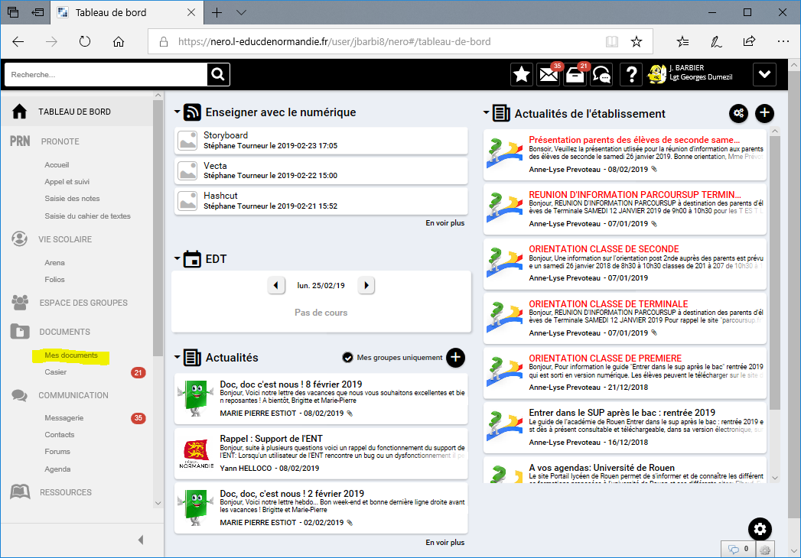
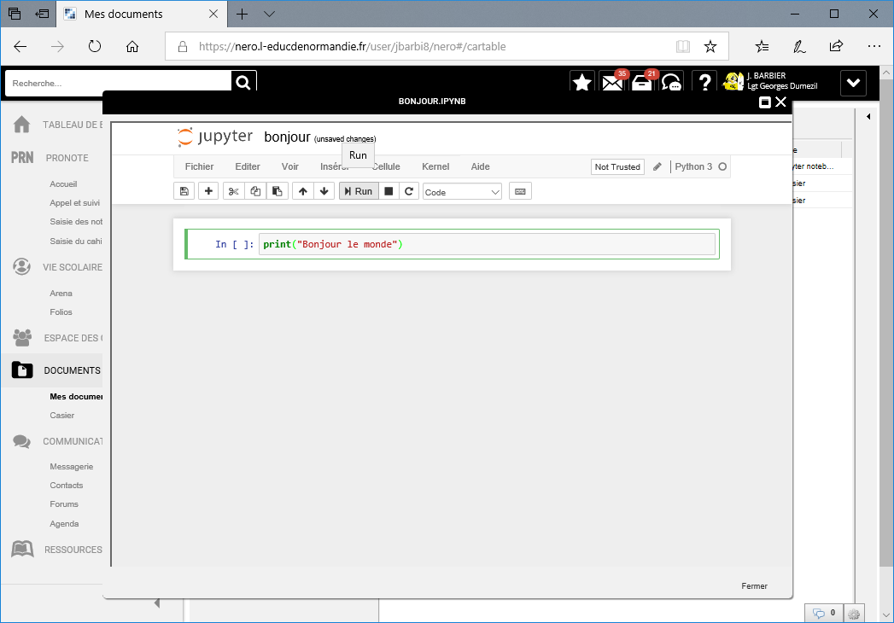
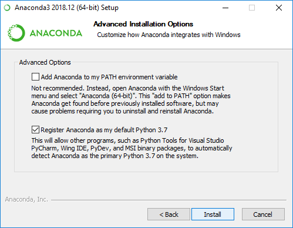
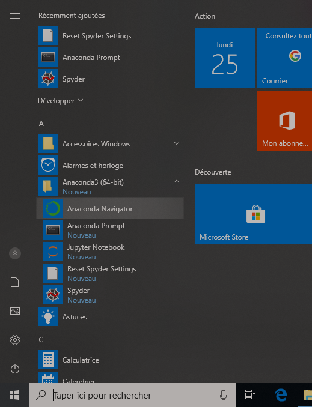

# Introduction
## Contexte

Dans le cadre de la réforme du lycée, les nouveaux programmes de
physique-chimie mis en place à la rentrée 2019 introduisent un nouveau
challenge pour la discipline, à savoir **proposer des activités qui
impliquent les élèves dans la programmation et le codage**. Ces termes
sont à comprendre en un sens très large : le codage peut consister à
écrire complètement le programme (le langage Python est préconisé),
mais peut également se limiter à l’adaptation d’un code existant, en
modifiant les paramètres expérimentaux par exemple ou la précision
attendue des résultats.

Les enseignants de physique-chimie sont déjà impliqués depuis près de
trente ans dans les usages pédagogiques du numérique, d’une part dans
le traitement et l’acquisition de données expérimentales, certains
dans la modélisation ou la simulation, et tous, dans l’utilisation de
supports multimédia ou de logiciels dédiés pour préparer et animer
leurs cours. L’idée nouvelle est de **donner du sens à la
modélisation** d’un phénomène ou d’une loi, et que le logiciel utilisé
ne soit pas simplement une « boîte noire », dont l’élève ne connait ni
le fonctionnement intrinsèque, ni les hypothèses, ni les limites.

## Objectifs

L’introduction raisonnée et limitée de la programmation dans les programmes de physique-chimie a deux objectifs majeurs :

- Donner une **image actualisée de l’activité des scientifiques**, non
  seulement dans les études supérieures mais aussi dans de nombreux
  métiers.
- Apporter une plus-value dans les apprentissages, en développant les
**compétences clés de la démarche scientifique** : raisonnement logique,
capacité d’analyse par décomposition d’un problème complexe,
distinction entre paramètres et variables, validation d’un modèle avec
ou sans ajustement nécessaire, etc. 


## Mise en œuvre


Pour celui qui n’a jamais programmé, ou qui a de vagues souvenirs de
ses études, un **accompagnement** est nécessaire, et c’est ce que
propose ce guide. Il débute avec l’installation du logiciel Python,
qui envisage plusieurs environnements possibles selon les contextes
d’établissement ; il explique les bases de la programmation, passe en
revue les différentes fonctions du logiciel Python, **avec des
exemples systématiquement empruntés à la physique-chimie**. Puis il
propose des activités en relation directe avec les programmes de
seconde et de première (voir capacités exigibles ci-dessous). Enfin il
fournit un mémento, sur la syntaxe Python et sur le notebook Jupyter,
pour que le professeur ait accès directement et rapidement à des
éléments clés de la programmation, lorsqu’il prépare son cours.

> Capacités exigibles 
> 
> - Représenter les positions successives d’un système modélisé par un
>   point, lors d’une évolution unidimensionnelle ou bidimensionnelle
>   (2de) 
>
> - Représenter des vecteurs vitesse d’un système modélisé par
>   un point, lors d’un mouvement (2de) 
>
> - Représenter un nuage de points associé à la caractéristique d’un
>   dipôle, et modéliser la caractéristique de ce dipôle (2de)
>
> - Déterminer la composition de l’état final d’un système siège d’une
>   transformation chimique totale (1ère générale)
>
> - Étudier la relation approchée entre la variation du vecteur
>   vitesse d’un système modélisé par un point matériel entre deux
>   instants voisins et la somme des forces appliquées sur celui-ci
>   (1ère générale)
> 
> - Effectuer le bilan énergétique d’un système en mouvement (1ère
>   générale)
>
> - Représenter un signal périodique et illustrer l’influence de ses
>   caractéristiques (période, amplitude) sur sa représentation (1ère
>   générale)
>
> - Simuler la propagation d’une onde périodique (1ère générale)

## Réserves et perspectives

Les objectifs du programme se veulent restreints, l’accent est mis sur
la **plus-value** que la programmation peut apporter en termes
**d’apprentissage et d’assimilation de notions de physique-chimie**. Le
but n’est pas de développer les compétences en codage des élèves, mais
plutôt de s’appuyer sur les acquis de la formation qu’ils reçoivent
par ailleurs, dans le cadre d’enseignements spécifiques ou au sein de
certaines disciplines. Le recours à des tableurs ou à des logiciels de
géométrie dynamique peut également conduire à des activités que l’on
peut considérer comme de la programmation si l’élève conçoit lui-même
de façon algorithmique, l’organisation des calculs ou la succession
des opérations à réaliser.

Ce guide ne se veut pas exhaustif ni modélisant, c’est une aide pour
démarrer avec Python. De nombreuses ressources existent sur le web,
notamment des MOOC très bien conçus, pour aller plus loin. Chaque
enseignant pourra, selon ses goûts et affinités, approfondir avec le
temps, pour lui ou avec ses élèves, toutes les possibilités de mise en
œuvre de la programmation dans son enseignement.

# Environnement python

## Introduction

Le `Python` est un langage **interprété**, c'est à dire que les
instructions écrites dans un simple fichier texte par l'utilisateur
sont ensuite "traduites" par le programme `Python` en instructions
exécutables par l'ordinateur.

Il est donc nécessaire de disposer de cet interpréteur pour pouvoir
exécuter un programme écrit en python.

Si votre établissement dispose de l'ENT Pentila Nero (celui auquel on
accède via
[www.l-educdenormandie.fr](https://www.l-educdenormandie.fr)), vous
avez déjà un environnement python prêt à être utilisé.

Si ce n'est pas le cas, alors vous allez devoir passer par l'étape
"installation de python", un peu plus loin dans ce document.

## Python via l'ENT

Pour utiliser les fonctionnalités python via votre ENT, connectez vous
sur votre ENT "comme d'habitude".


Naviguez ensuite vers votre espace "Mes documents"



Cliquez ensuite sur le bouton "Créer" (ou bien via un clic droit de la
souris) : dans la liste des formats de fichier disponible, vous
devriez voir apparaître "Jupyter Notebook". 


Si "Jupyter Notebook" n'apparaît pas, il faut demander à
l'administrateur ENT de votre établissement de l'activer. La procédure
prend moins d'une minute, les détails sont à la fin de ce document).

Si il apparaît, cliquez dessus, et nommez votre fichier. Une fenêtre
apparaît alors, c'est votre nouveau notebook.


Vous alors pouvez taper 

```python
print("Bonjour le monde")
```

dans la cellule "In".



Exécutez ensuite ce premier programme en cliquant sur
le bouton "Run". Vous devriez voir apparaître la phrase "Bonjour le
monde" juste en dessous. 


Vous avez exécuté votre premier programme python. Vous pouvez
maintenant passer à la suite de ce document, en sautant éventuellement
les deux chapitres suivant.

## Installation de python sous Windows

Le programme `Python` seul, que l'on trouve sur le site
[python.org](https://python.org) n'est donc pas très gros, quelques
méga-octets au plus. Il en existe plusieurs générations, que l'on
repère à leur numéro de version : `2.x` ou `3.x`. Il est fortement
recommandé d'utiliser la génération `3.x` (3.7 aujourd'hui), même si
beaucoup d'exemples que l'on peut trouver sur internet sont de la
génération `2.x`.

`Python` seul a déjà beaucoup de fonctionnalités à la base. Mais ce
qui fait sa richesse, c'est le nombre énorme de "paquets" qu'on peut
lui ajouter (des fonctionnalités créées par d'autres personnes et
qu'on peut directement réutiliser).

Il n'est pas évident de rajouter à la main un paquet sous windows,
c'est pour cela que plusieurs *distributions* de python (le programme
python + un choix de paquets) sont disponibles. Chaque distribution a
ses avantages et ses inconvénients. Nous avons fait le choix
d'utiliser une des plus complètes, [anaconda](https://anaconda.com).


### Installation

Les instructions suivantes sont pour une installation sous Windows 10,
64 bits, sur un système avec au moins 3 Go de disque disponible.

Si une autre version de python est déjà présente sur le système, il
vaut mieux la désinstaller au préalable. Anaconda n'est pas intrusif,
mais d'autres distributions le sont plus et peuvent poser un problème
de cohabitation.

**Etape 1** Télécharger anaconda

Sur le site [anaconda.com](https://anaconda.com), bouton **Download**
en haut à gauche. Choisir la version correspondant à votre système
(32/64 bits).

Le téléchargement prend un certain temps (+ de 600 Mo).


**Etape 2** Installer anaconda

Lancer le programme d'installation; les valeurs par défaut des
différentes étapes sont suffisantes, en gros : 

- accepter la licence
- choisir une installation "mono-utilisateur" (juste pour vous)
- choisir le dossier d'installation (si possible, un chemin sans
espaces est préférable)
- définir anaconda comme interpréteur python par défaut





Puis attendre la fin de la copie des fichiers (qui prend aussi un
certain temps)


Une fois la copie des fichiers terminées et l'apparition de quelques
fenêtres noires (qu'il ne faut pas fermer, elles se ferment toute
seules quand elles ont terminé leur travail), l'installateur propose
l'installation de Visual Studio Code (un éditeur de code d'assez bonne
qualité). Vous pouvez l'installer ou non, au choix, nous utiliserons
un autre éditeur pour l'instant.

Puis il propose deux autres cases à cocher pour en apprendre plus,
vous pouvez les décocher ou jeter un coup d'oeil aux ressources
proposées.

Anaconda est alors installé.

### Exécution : Anaconda Navigator

Les différentes fonctionnalités d'anaconda sont regroupées dans une
interface appelée *Anaconda Navigator*. Vous pouvez y accéder par le
menu Démarrer, dans la rubrique *Anaconda*.



La page d'accueil d'Anaconda Navigator présente les différentes
applications installées (Launch) ou installables (Install).


La plupart des exemples de ce guide sont des **Notebooks
Jupyter**. Démarrer Jupyter en cliquant sur "Launch"; au premier
lancement, vous aurez éventuellement à choisir le navigateur de votre
choix pour utiliser les notebooks. Choisissez ce que vous voulez sauf
Internet Explorer.

Dans la fenêtre de navigateur qui s'ouvre, vous trouverez la liste de
vos dossiers. Vous pouvez naviguer dans l'arborescence de vos
documents; choisissez le répertoire de votre choix, et une fois que
vous êtes dedans, vous pouvez créer votre premier notebook : bouton
"New" en haut à droite, choisir "Python 3".


Un nouvel onglet s'ouvre alors, avec votre notebook.


Pour modifier le titre du notebook, cliquez dessus une fois qu'il est
ouvert. Dans la cellule "Entrée", vous pouvez écrire

```python
print("Bonjour le monde")
```

et cliquer sur le bouton "Exécuter". Vous devriez voir apparaître la
phrase "Bonjour le monde" juste en dessous.

Vous avez fait votre premier programme en python. Vous pouvez
maintenant continuer à explorer les ressources de ce guide.


## Activation des notebooks sur Nero

TODO


# Guide d’utilisation rapide du Notebook Jupyter

- Type de cellules (Markdown, code…)
  - Cellule Markdown : contextualisation de la physique ou explication
        de la démarche 
  - Cellule Code : Code et commentaires (instruction de commande pour
    l’élève)
- Exécution des cellules
- Numérotation des lignes

# Format Notebook
Premiers pas vers la programmation en Python

- Quelques exemples de programmes à exécuter sur Notebook
(commentaires dans les programmes) AD 
	- Atome et structure électronique
		- Décroissance radioactive
        - Animation onde progressive
    - Bases de programmation ((1 cellule algorithme en français, 1
	  cellule ligne de code sur Notebook) 
	    - Structure d’un programme AD
            - Commentaires (# commentaires de commandes, docstring
            commentaires de fonction) 
		- Indentations
        - Bibliothèques (numpy, matplotlib, math, random, csv, …)
 - Affectation de variables (input, typage (integer, float, char,
   booléen…), notation scientifique) AD
- Affichage à l’écran (print) AD
- Opérations mathématiques, logiques PD
- Tests (if) AD
- Boucles (while…) AD
- Fonctions DD
- Listes ([], append…) DD
- Récupération de fichier CSV GR
- Graphiques GR
- Modélisation GR
- Animation GR

# Mémos
## Syntaxe Python pour la physique-chimie DD


## Mémo Notebook Jupyter JMB
### Syntaxe Markdown

Le Markdown est une manière d'écrire simplement un texte pouvant être
transformé facilement en un autre type de document (pdf, html,
word...) en utilisant quelques conventions pour obtenir une mise en
forme ou des fonctionnalités, tout en restant facilement lisible pour
un être humain.

Il est ainsi possible de créer des titres, mettre du texte en gras, en
italique, créer des listes, des liens, insérer des images, des
formules mathématiques, ..

	# Un titre
	## Un sous-titre
    
	On peut formatter du texte **en gras**, en *italique*.
	On peut mettre `des extraits de code`
    
	- une liste non numérotée
    - élément 2
    - élément 3
    
	Une liste numérotée :
    
    1. liste numérotée
    2. liste numérotée 2
    3. liste numérotée

	Pour changer de paragraphe
    il faut 
    laisser une
    une ligne blanche,
	toute cette phrase ne sera que dans un paragraphe.
	
	Prochain paragraphe

	Ecrire des maths : $x^2$ ou une formule séparée : $$\frac{x^2}{\sqrt{3}}$$

	```python
    print("toto")
    ```

### Mémo LaTeX pour les formules de physique

Une formule mathématique se trouve entre deux caractères \$. Deux modes
d'affichage sont possible : en ligne, et en séparé. Une formule en
ligne est affichée dans le texte : `$x^{p-2}\$` se lit $x^{2-p}$, alors
qu'une formule en séparé (début et fin avec deux signes \$) est
affichée sur sa propre ligne : `$$\sqrt{3x-2}$$` s'affiche
$$\sqrt{3x-2}$$

#### Notations utiles

- Exposant : `$Cl^-$` : $Cl^-$. Si plusieurs lettres en exposant :
  `$Mg^{2+}$` : $Mg^{2+}$
- Indice : `$CO_2$` : $CO_2$. Si plusieurs lettres en indice :
  `$CO_{2_{(g)}}$` : $CO_{2_{(g)}}$
- Exposant et indice `$CO_3^{2-}$` : $CO_3^{2-}$ 
- Espace et flèche `$2\ A+3\ B \rightarrow C$` : $2\ A+3\ B \rightarrow C$

- Fraction : `$\frac{A}{B}$` : $\frac{A}{B}$
- Racine carrée : `$\sqrt{A}$` : $\sqrt{A}$
- Vecteur : `$\vec{u}$` : $\vec{u}$ ou `$\overrightarrow{AB}$` : $\overrightarrow{AB}$
- Somme : `$\sum_{n=1}^p n^p$` : $\sum_{n=1}^p n^p$

 

